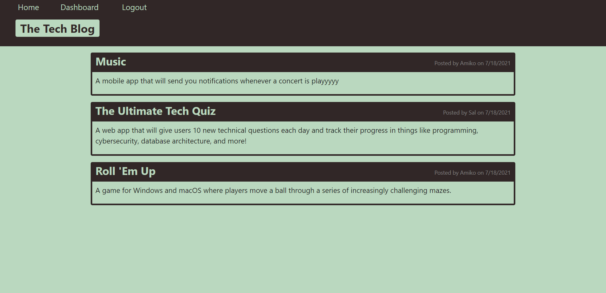

# Tech Blog

# Description:

It is a web application where you can read posts from other users and create posts and comment on posts.

# Table of Contents:

- [Installation](#installation)
- [Usage](#usage)
- [License](#license)
- [Contact me](#contact-me)

# Installation:

1. Fork this repo.
2. Clone onto your local machine.

# Usage:

Click [here](https://tech-blog-appli.herokuapp.com/) and create an account so you can comment and create posts.

# License:

This project is licensed under the MIT license, which you can read about [here](https://opensource.org/licenses/MIT).

# Contact me:

Contact me using my [GitHub](https://github.com/Justinean) or my email: justinonlycoding@gmail.com
